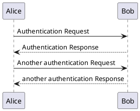
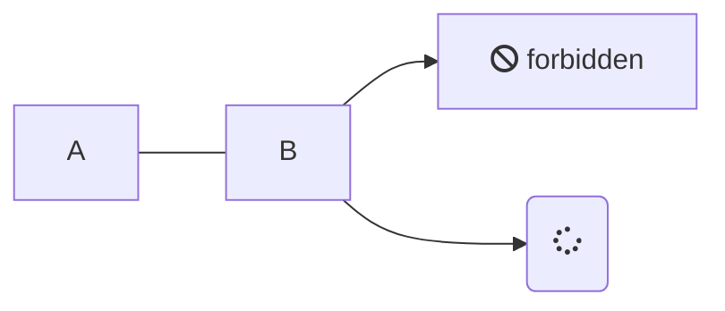

# Примеры

## PlantUML

## meramind

## Diagrams.net

- Сохранить/создать диаграмму в репозитории
- Выбрать File > Embed > IFrame
- Вставить код

<iframe frameborder="0" style="width:100%;height:363px;" src="https://viewer.diagrams.net/?highlight=0000ff&edit=_blank&layers=1&nav=1&title=example.xml#Uhttps%3A%2F%2Fraw.githubusercontent.com%2Fx0k%2FG122%2Fmaster%2Fdocs%2Fdiagrams%2Fexample.xml"></iframe>
