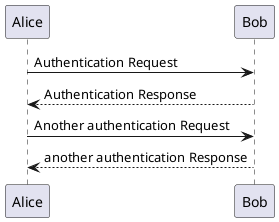
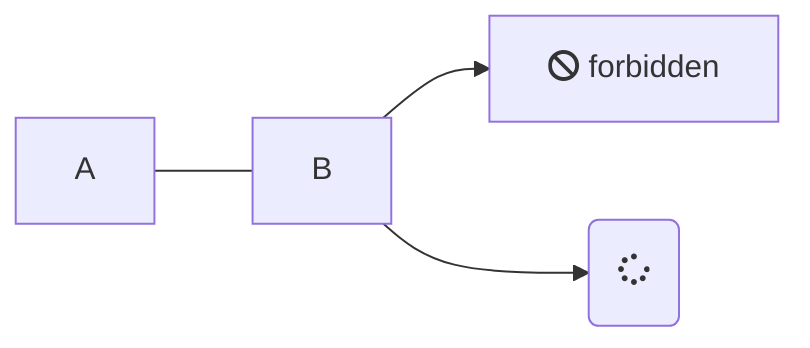

# Примеры

## PlantUML

## meramind

## Diagrams.net

- Добавить диаграмму в XML формате
- [Тут](https://jgraph.github.io/drawio-tools/tools/viewer.html) сформировать код встраивания (или скопировать код примера)
  - Пример ссылки на файл `https://raw.githubusercontent.com/x0k/G122/master/docs/diagrams/example.xml`, где `example.xml` имя диаграммы в папке `diagrams`
  - Режим IFrame

<iframe frameborder="0" style="width:100%;height:500px;" src="https://www.draw.io?lightbox=1#Uhttps%3A%2F%2Fraw.githubusercontent.com%2Fx0k%2FG122%2Fmaster%2Fdocs%2Fdiagrams%2Fexample.xml"></iframe>
